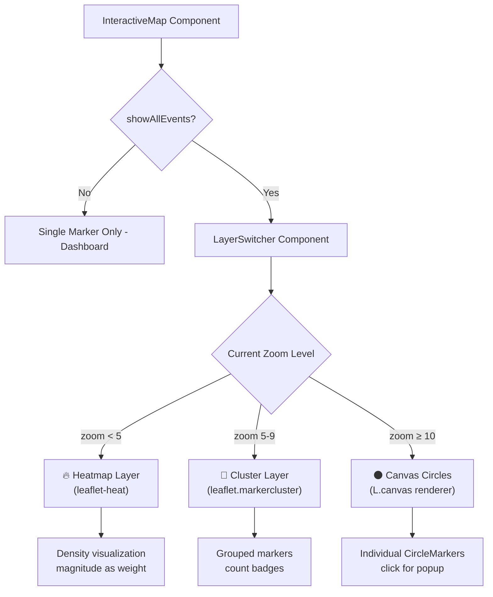

# Multi-Layer Map Rendering: Canvas + Clusters + Heatmap + Dynamic Switching

Optimize the `InteractiveMap` component by replacing 1,500+ DOM nodes with a performant, zoom-aware rendering pipeline that automatically switches between heatmap, marker clusters, and canvas circles.

## Current State

- [InteractiveMap.tsx](file:///c:/Users/Wneljae/Desktop/Mini%20Projects/Earthquake%20App/src/components/InteractiveMap.tsx) renders earthquake markers as `<CircleMarker>` components (SVG by default, though `preferCanvas={true}` is already set on both `MapContainer` instances)
- Each marker includes a permanent `<Tooltip>` showing magnitude — these tooltips are SVG DOM nodes even with canvas rendering
- The component has two map instances: one in-page and one fullscreen (portal)
- The existing `supercluster` and `use-supercluster` dependencies in [package.json](file:///c:/Users/Wneljae/Desktop/Mini%20Projects/Earthquake%20App/package.json) are **unused** — we'll use `leaflet.markercluster` instead for native Leaflet integration
- Used on the [Dashboard](file:///c:/Users/Wneljae/Desktop/Mini%20Projects/Earthquake%20App/src/pages/Dashboard.tsx) (single latest event) and [Stats](file:///c:/Users/Wneljae/Desktop/Mini%20Projects/Earthquake%20App/src/pages/Stats.tsx) (`showAllEvents=true`, the heavy use case)

## User Review Required

> [!IMPORTANT]
> **Dual Map Architecture**: The component currently renders two separate `MapContainer` instances (inline + fullscreen portal). The dynamic layer switching logic will need to be duplicated or abstracted into a shared hook. I'll use a **custom hook** (`useLayerManager`) to keep the logic DRY.

> [!WARNING]
> **Tooltip Removal on Canvas/Heatmap layers**: The permanent magnitude tooltips on each `CircleMarker` are DOM-heavy. At zoom ≥ 10 (canvas circles mode), I'll keep tooltips for small visible sets, but they'll be hidden at lower zooms where clusters/heatmap are shown. This is a UX tradeoff for performance.

> [!IMPORTANT]
> **Dashboard Map Excluded**: The Dashboard map only shows the latest earthquake marker (not `showAllEvents`), so the heatmap/cluster layers won't apply there. The dynamic switching will only activate when `showAllEvents={true}`.

## Proposed Changes

### Phase 1: Dependencies

#### [MODIFY] [package.json](file:///c:/Users/Wneljae/Desktop/Mini%20Projects/Earthquake%20App/package.json)

Install new dependencies:
- `leaflet.markercluster` — cluster plugin for Leaflet
- `leaflet-heat` — heatmap plugin for Leaflet (Leaflet 1.x compatible)
- `@types/leaflet.markercluster` — TypeScript types

Remove unused dependencies:
- `supercluster`, `use-supercluster`, `@types/supercluster` — not used anywhere

---

### Phase 2: Canvas Renderer (Quick Win)

#### [MODIFY] [InteractiveMap.tsx](file:///c:/Users/Wneljae/Desktop/Mini%20Projects/Earthquake%20App/src/components/InteractiveMap.tsx)

- `preferCanvas={true}` is already set — CircleMarkers already render to canvas ✅
- Remove the permanent `<Tooltip>` elements from CircleMarkers to eliminate DOM overhead (the magnitude text will still be visible on click/popup)
- The remaining DOM optimization comes from Phases 3-4 where we batch via clusters/heatmap at lower zoom levels

---

### Phase 3: Custom Hook — `useLayerManager`

#### [NEW] [useLayerManager.ts](file:///c:/Users/Wneljae/Desktop/Mini%20Projects/Earthquake%20App/src/hooks/useLayerManager.ts)

A React hook that manages the three layers based on the current zoom level:

```
Zoom < 5    → Heatmap layer (density visualization)
Zoom 5–9    → MarkerCluster layer (grouped with count badges)
Zoom ≥ 10   → Canvas CircleMarkers (individual points)
```

The hook will:
1. Listen to `zoomend` events on the Leaflet map instance
2. Track the current `activeLayer` state: `'heatmap' | 'clusters' | 'circles'`
3. Add/remove the appropriate Leaflet layers imperatively (heatmap and clusters are vanilla Leaflet plugins, not react-leaflet components)
4. Return `{ activeLayer, layerIndicator }` for the UI to show which mode is active

---

### Phase 4: Heatmap Layer

#### [MODIFY] [InteractiveMap.tsx](file:///c:/Users/Wneljae/Desktop/Mini%20Projects/Earthquake%20App/src/components/InteractiveMap.tsx)

- Create a `HeatmapManager` child component that uses `useMap()` to access the Leaflet instance
- Convert earthquake data to `[lat, lng, intensity]` points where intensity = magnitude (normalized)
- Configure gradient colors matching the app's severity palette
- The heatmap layer is added/removed by the hook based on zoom

---

### Phase 5: Marker Cluster Layer

#### [MODIFY] [InteractiveMap.tsx](file:///c:/Users/Wneljae/Desktop/Mini%20Projects/Earthquake%20App/src/components/InteractiveMap.tsx)

- Create a `ClusterManager` child component that uses `useMap()` to access the Leaflet instance
- Initialize `L.markerClusterGroup()` with custom styling for cluster icons (dark theme, magnitude-based colors)
- Populate with `L.circleMarker()` instances for each earthquake
- The cluster layer is added/removed by the hook based on zoom
- Cluster icon styling: dark background, count badge, color = average severity of contained markers

---

### Phase 6: Dynamic Layer Switching & Integration

#### [MODIFY] [InteractiveMap.tsx](file:///c:/Users/Wneljae/Desktop/Mini%20Projects/Earthquake%20App/src/components/InteractiveMap.tsx)

- Add a `LayerSwitcher` child component inside each `MapContainer` that orchestrates all three layers
- On `zoomend`, determine which layer should be active and swap accordingly
- Add a small **zoom indicator badge** in the map UI showing the current mode (🔥 Heatmap / 📍 Clusters / ⚫ Points)
- Ensure the popup system still works across all three layer types

#### [MODIFY] [InteractiveMap.css](file:///c:/Users/Wneljae/Desktop/Mini%20Projects/Earthquake%20App/src/components/InteractiveMap.css)

- Add styles for cluster icons (dark theme, glass morphism)
- Add styles for the layer mode indicator badge
- Add styles for the markercluster plugin overrides

---

### Phase 7: Type Declaration

#### [NEW] [leaflet-plugins.d.ts](file:///c:/Users/Wneljae/Desktop/Mini%20Projects/Earthquake%20App/src/types/leaflet-plugins.d.ts)

- Declare module `'leaflet-heat'` since it doesn't ship types
- Extend `L` namespace for the `heat()` factory function

---

## Architecture Diagram



## Open Questions

> [!IMPORTANT]
> **Zoom Thresholds**: I've proposed `< 5` for heatmap, `5-9` for clusters, `≥ 10` for circles. Since the Philippine map typically starts at zoom 5-8, do you want different breakpoints? The default view starts at zoom 5 (no latest) or zoom 8 (with latest event).

> [!NOTE]
> **Cluster Click Behavior**: When clicking a cluster bubble, should it (a) zoom in to expand the cluster, or (b) show a popup listing all earthquakes in that cluster? Standard behavior is (a) — zoom to expand.

## Verification Plan

### Manual Verification
1. Open the Stats page → map should start with appropriate layer for current zoom
2. Zoom out to zoom < 5 → heatmap should appear, circles/clusters should disappear
3. Zoom to 5-9 → clusters with count badges should appear
4. Zoom to ≥ 10 → individual canvas circles should appear with click-to-popup
5. Open fullscreen map → same layer switching behavior
6. Dashboard map → should still show single latest marker normally (no layer switching)
7. Check browser DevTools → confirm canvas rendering (no SVG circle elements)

### Performance Check
- Open Stats with all events → check that DOM node count stays low at all zoom levels
- Compare before/after: previous SVG approach vs new canvas + layer switching
